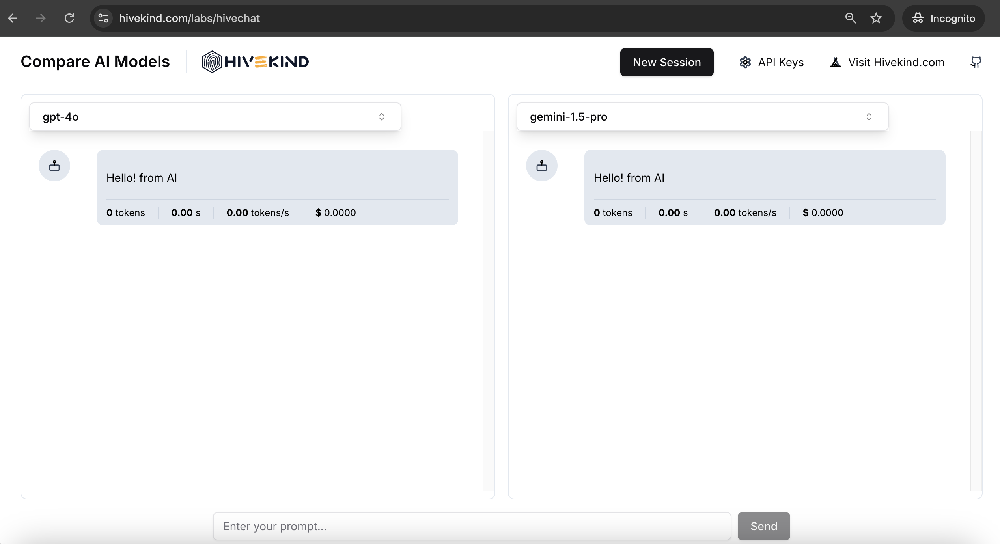

# HiveChat

## Project Description
HiveChat is a fully client-side chat application built with Next.js, allowing users to compare the output of different AI models (OpenAI and Gemini) side by side. Users can bring their own API keys to access the models, select different models for each chat box, and compare the responses concurrently.



## Getting Started

First, run the development server:

```bash
npm run dev
```

You can access the app by opening [http://localhost:3000/hivechat](http://localhost:3000/hivechat) in your browser.


## Prerequisites
To use this app, you will need:

- An API key from OpenAI
- An API key from Gemini

Once you have the keys, you can enter them into the `API Keys` settings in the app to start chatting.

## How to Use

- Select a model for each chat box (OpenAI or Gemini).
- Enter a message and get responses from the models.
- Compare the responses side by side.


## Initial command to create this project

This project was initially created using the following command:

```bash
npx create-next-app@latest
```
